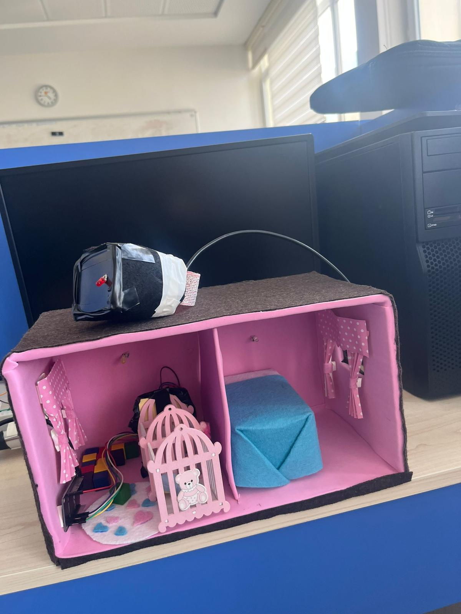
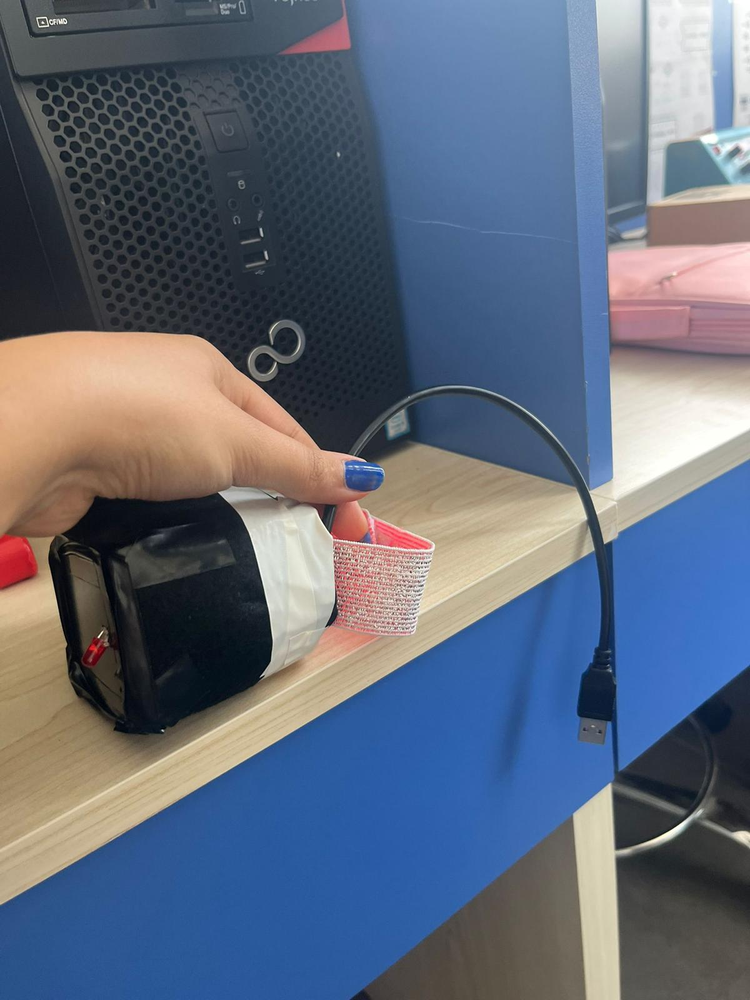
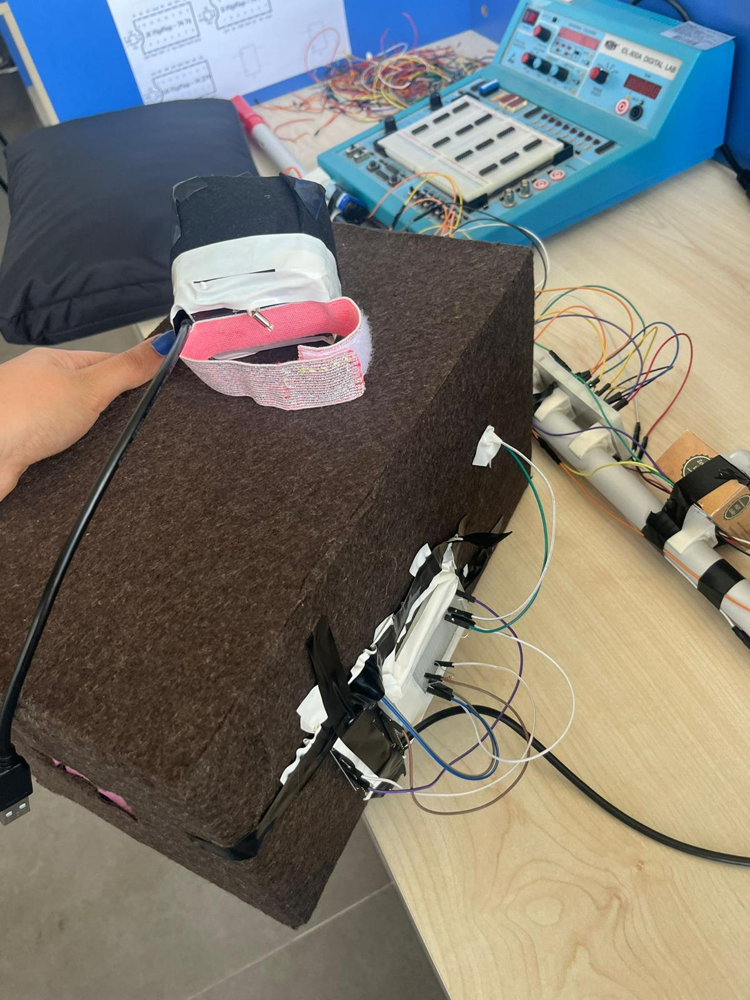
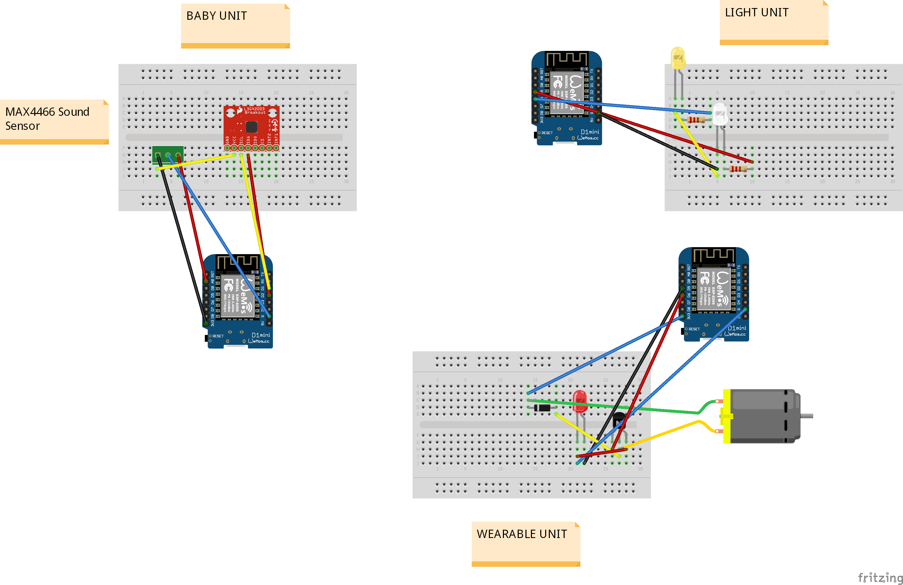

# Haptic Visual Baby Monitoring System

## Project Overview

This project is an IoT-based baby monitoring system designed to improve infant safety through haptic and visual alert mechanisms.

The system detects critical situations such as crying sounds or abnormal movements and instantly notifies caregivers using wireless communication.

The project consists of three main units:

- **Baby Unit** → Detects sound and motion conditions.
- **Light Unit** → Provides visual LED alerts.
- **Wearable Unit** → Sends vibration-based notifications to caregivers.

---

## Project Prototype

This section presents the physical implementation and prototype of the system.

### Main Prototype

### Additional Prototype Views

---

## Circuit Design

The following image shows the Fritzing circuit design of the baby monitoring system.

---

## System Architecture

The system works through sensor-based monitoring and ESP-NOW wireless communication between units.

### Baby Unit
- Detects crying sounds using a sound sensor
- Monitors movement using MPU6050
- Sends alert signals to other units

### Wearable Unit
- Provides haptic feedback through vibration
- Allows caregivers to receive notifications instantly

### Light Unit
- Provides visual LED notifications
- Generates warning signals in emergency situations

---

## Hardware Components

- ESP8266 NodeMCU
- MPU6050 Motion Sensor
- Sound Sensor (MAX4466)
- LED Alert Module
- Wearable Vibration Module
- Breadboard & Jumper Wires

---

## Technologies Used

- Arduino IDE
- Embedded C/C++
- ESP-NOW Communication
- IoT Systems
- Fritzing

---

## Source Code Structure

- `01_MAC_Address_Finder/` → MAC address detection utility
- `02_Light_Unit.ino/` → Light unit source code
- `03_Wearable_Unit.ino/` → Wearable unit source code
- `04_Baby_Unit.ino/` → Baby monitoring unit source code
- `images/` → Project images and circuit diagrams

---

## Authors

**Ayşe Tuğba Peköz**  

Computer Engineering Project
